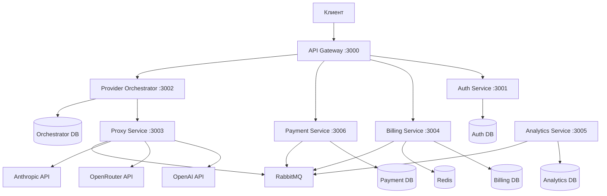

# Архитектура системы

## Обзор

AI Aggregator построен на микросервисной архитектуре, обеспечивающей высокую масштабируемость, отказоустойчивость и гибкость развертывания.

## Принципы архитектуры

### 1. Микросервисная архитектура
- Каждый сервис независим и развертывается отдельно
- Слабая связанность между сервисами
- Высокая когезия внутри сервиса

### 2. Database per Service
- Каждый сервис имеет собственную базу данных
- Изоляция данных между сервисами
- Независимое масштабирование

### 3. Асинхронная коммуникация
- RabbitMQ для бизнес-процессов
- HTTP для синхронных вызовов
- Event-driven архитектура

## Схема системы



## Микросервисы

### API Gateway (Порт 3000)
**Назначение**: Единая точка входа для всех клиентских запросов

**Основные функции**:
- Маршрутизация запросов к соответствующим сервисам
- Агрегация ответов от нескольких сервисов
- Rate limiting и throttling
- Аутентификация и авторизация
- Логирование и мониторинг

**Технологии**: NestJS, Express, JWT

### Auth Service (Порт 3001)
**Назначение**: Управление аутентификацией и пользователями

**Основные функции**:
- Регистрация и аутентификация компаний
- Управление JWT токенами
- Создание и управление API ключами
- Управление ролями и правами доступа
- Система рефералов

**База данных**: PostgreSQL (auth_db)
**Технологии**: NestJS, Prisma, bcrypt, JWT

### Provider Orchestrator (Порт 3002)
**Назначение**: Управление провайдерами и маршрутизация запросов

**Основные функции**:
- Выбор оптимального провайдера для запроса
- Мониторинг доступности провайдеров
- Балансировка нагрузки
- Управление конфигурацией провайдеров
- Кэширование информации о провайдерах

**База данных**: PostgreSQL (orchestrator_db)
**Технологии**: NestJS, Prisma, Redis

### Proxy Service (Порт 3003)
**Назначение**: Проксирование запросов к внешним ИИ-провайдерам

**Основные функции**:
- Проксирование запросов к OpenAI, OpenRouter, Anthropic
- Трансформация форматов запросов и ответов
- Обработка ошибок и retry логика
- Мониторинг производительности провайдеров
- Кэширование ответов

**Технологии**: NestJS, Axios, Redis

### Billing Service (Порт 3004)
**Назначение**: Управление биллингом и тарификацией

**Основные функции**:
- Управление балансами компаний
- Обработка транзакций
- Расчет стоимости запросов
- Система подписок и планов
- Обработка реферальных комиссий
- Генерация отчетов

**База данных**: PostgreSQL (billing_db)
**Технологии**: NestJS, Prisma, Decimal.js

### Analytics Service (Порт 3005)
**Назначение**: Сбор и анализ метрик использования

**Основные функции**:
- Сбор метрик использования
- Анализ производительности
- Генерация отчетов
- Интеграция с Grafana
- Алерты и уведомления

**База данных**: PostgreSQL (analytics_db)
**Технологии**: NestJS, Prisma, Prometheus

### Payment Service (Порт 3006)
**Назначение**: Обработка платежей и интеграция с платежными системами

**Основные функции**:
- Интеграция с YooKassa
- Обработка SBP платежей
- Управление курсами валют
- Обработка webhook'ов
- Управление статусами платежей

**База данных**: PostgreSQL (payment_db)
**Технологии**: NestJS, Prisma, CBR API

## Коммуникация между сервисами

### Синхронная коммуникация (HTTP)
Используется для:
- Валидации токенов (API Gateway → Auth Service)
- Получения баланса (API Gateway → Billing Service)
- Проверки доступности провайдеров (Orchestrator → Proxy Service)

### Асинхронная коммуникация (RabbitMQ)
Используется для:
- Обработки биллинга (Proxy Service → Billing Service)
- Сбора метрик (все сервисы → Analytics Service)
- Обработки платежей (Payment Service → Billing Service)
- Маршрутизации запросов (Orchestrator → Proxy Service)

## Базы данных

### Принципы
- **Database per Service**: Каждый сервис имеет собственную БД
- **Изоляция данных**: Сервисы не имеют прямого доступа к чужим БД
- **Независимое масштабирование**: Каждая БД может масштабироваться отдельно

### Схемы БД

#### Auth Service
```sql
-- Основные таблицы
companies          -- Компании/пользователи
api_keys          -- API ключи
referral_codes    -- Реферальные коды
security_events   -- События безопасности
```

#### Billing Service
```sql
-- Основные таблицы
company_balances  -- Балансы компаний
transactions     -- Транзакции
usage_events     -- События использования
pricing_rules    -- Правила тарификации
subscriptions    -- Подписки
```

#### Payment Service
```sql
-- Основные таблицы
payments         -- Платежи
payment_methods  -- Способы оплаты
exchange_rates   -- Курсы валют
```

## Кэширование

### Redis
Используется для:
- Кэширования JWT токенов
- Кэширования балансов компаний
- Кэширования информации о провайдерах
- Rate limiting
- Сессий пользователей

### Стратегии кэширования
- **TTL кэширование**: Автоматическое истечение
- **Write-through**: Запись в кэш и БД одновременно
- **Cache-aside**: Загрузка в кэш по требованию

## Мониторинг и логирование

### Логирование
- **Structured logging**: JSON формат логов
- **Correlation ID**: Отслеживание запросов через сервисы
- **Log levels**: DEBUG, INFO, WARN, ERROR
- **Centralized logging**: Сбор логов в едином месте

### Метрики
- **Prometheus**: Сбор метрик
- **Grafana**: Визуализация метрик
- **Custom metrics**: Бизнес-метрики
- **Health checks**: Проверка состояния сервисов

### Трассировка
- **Distributed tracing**: Отслеживание запросов
- **Jaeger**: Визуализация трассировки
- **Performance monitoring**: Мониторинг производительности

## Безопасность

### Аутентификация
- **JWT токены**: Stateless аутентификация
- **API ключи**: Для программного доступа
- **Refresh tokens**: Обновление токенов
- **Rate limiting**: Ограничение частоты запросов

### Авторизация
- **RBAC**: Role-Based Access Control
- **Права доступа**: Гранулярные разрешения
- **Аудит**: Логирование действий пользователей

### Защита данных
- **Шифрование паролей**: bcrypt
- **HTTPS**: Шифрование трафика
- **Валидация входных данных**: Защита от инъекций
- **CORS**: Настройка cross-origin запросов

## Масштабирование

### Горизонтальное масштабирование
- **Load balancing**: Распределение нагрузки
- **Stateless services**: Без состояния
- **Database sharding**: Разделение БД
- **Caching**: Снижение нагрузки на БД

### Вертикальное масштабирование
- **Resource allocation**: Выделение ресурсов
- **Performance tuning**: Оптимизация производительности
- **Database optimization**: Оптимизация БД

## Отказоустойчивость

### Circuit Breaker
- **Автоматическое отключение**: При сбоях сервисов
- **Fallback механизмы**: Резервные варианты
- **Health checks**: Проверка состояния

### Retry логика
- **Exponential backoff**: Экспоненциальная задержка
- **Dead letter queues**: Обработка неудачных сообщений
- **Idempotency**: Идемпотентность операций

### Graceful shutdown
- **Graceful shutdown**: Корректное завершение
- **Connection draining**: Завершение активных соединений
- **Data consistency**: Сохранение консистентности данных
