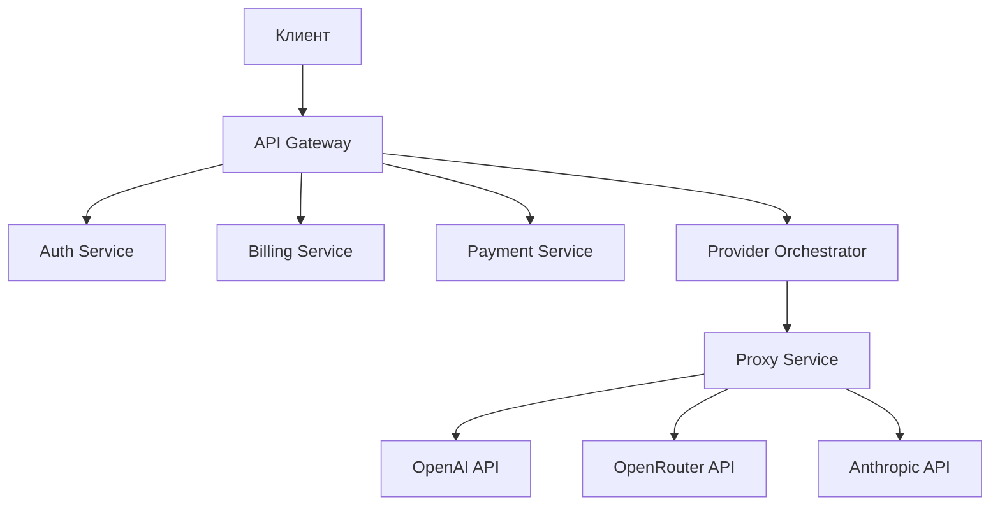

# API Gateway

## Описание

API Gateway является единой точкой входа для всех клиентских запросов. Он обеспечивает маршрутизацию, аутентификацию, rate limiting и агрегацию ответов от различных микросервисов.

## Основные функции

- **Маршрутизация запросов** к соответствующим микросервисам
- **Аутентификация и авторизация** через JWT токены и API ключи
- **Rate limiting** для защиты от злоупотреблений
- **Агрегация ответов** от нескольких сервисов
- **Логирование и мониторинг** всех запросов
- **Валидация входных данных**

## Архитектура



## Конфигурация

### Переменные окружения

```bash
# Основные настройки
NODE_ENV=development
HOST=0.0.0.0
PORT=3000

# JWT
JWT_SECRET=your-super-secret-jwt-key-here

# Сервисы
AUTH_SERVICE_URL=http://auth-service:3001
BILLING_SERVICE_URL=http://billing-service:3004
PAYMENT_SERVICE_URL=http://payment-service:3006
ORCHESTRATOR_SERVICE_URL=http://provider-orchestrator:3002

# Redis
REDIS_URL=redis://redis:6379

# Rate limiting
RATE_LIMIT_WINDOW_MS=900000
RATE_LIMIT_MAX_REQUESTS=100
```

### Docker конфигурация

```yaml
api-gateway:
  build:
    context: .
    dockerfile: ./services/api-gateway/Dockerfile
  ports:
    - "3000:3000"
  environment:
    - NODE_ENV=development
    - HOST=0.0.0.0
    - PORT=3000
    - AUTH_SERVICE_URL=http://auth-service:3001
    - BILLING_SERVICE_URL=http://billing-service:3004
    - ORCHESTRATOR_SERVICE_URL=http://provider-orchestrator:3002
    - JWT_SECRET=your-super-secret-jwt-key-here
    - REDIS_URL=redis://redis:6379
  depends_on:
    - auth-service
    - billing-service
    - provider-orchestrator
  networks:
    - ai-aggregator
```

## API Endpoints

### Аутентификация

#### POST /api/v1/auth/register
Регистрация новой компании.

**Тело запроса:**
```json
{
  "email": "admin@company.com",
  "password": "securepassword123",
  "name": "My Company",
  "description": "AI-powered company"
}
```

**Ответ:**
```json
{
  "accessToken": "eyJhbGciOiJIUzI1NiIsInR5cCI6IkpXVCJ9...",
  "refreshToken": "eyJhbGciOiJIUzI1NiIsInR5cCI6IkpXVCJ9...",
  "tokenType": "Bearer",
  "expiresIn": 3600,
  "company": {
    "id": "company-uuid",
    "email": "admin@company.com",
    "name": "My Company",
    "role": "company",
    "isVerified": false
  }
}
```

#### POST /api/v1/auth/login
Вход в систему.

**Тело запроса:**
```json
{
  "email": "admin@company.com",
  "password": "securepassword123"
}
```

#### POST /api/v1/auth/refresh
Обновление токена.

**Тело запроса:**
```json
{
  "refreshToken": "eyJhbGciOiJIUzI1NiIsInR5cCI6IkpXVCJ9..."
}
```

#### POST /api/v1/auth/api-keys
Создание API ключа.

**Заголовки:**
```http
Authorization: Bearer <jwt-token>
```

**Тело запроса:**
```json
{
  "name": "Production API Key",
  "permissions": ["chat", "billing", "analytics"]
}
```

### Чат и ИИ

#### POST /api/v1/chat/completions
Создание чата с ИИ.

**Заголовки:**
```http
Authorization: Bearer <jwt-token>
# или
X-API-Key: <api-key>
```

**Тело запроса:**
```json
{
  "model": "gpt-4",
  "messages": [
    {
      "role": "user",
      "content": "Привет! Как дела?"
    }
  ],
  "temperature": 0.7,
  "max_tokens": 1000,
  "stream": false
}
```

**Ответ:**
```json
{
  "id": "chatcmpl-123",
  "object": "chat.completion",
  "created": 1677652288,
  "model": "gpt-4",
  "choices": [
    {
      "index": 0,
      "message": {
        "role": "assistant",
        "content": "Привет! У меня все отлично, спасибо за вопрос!"
      },
      "finish_reason": "stop"
    }
  ],
  "usage": {
    "prompt_tokens": 10,
    "completion_tokens": 15,
    "total_tokens": 25
  },
  "cost": 0.00125,
  "provider": "openai"
}
```

#### GET /v1/chat/models
Получение всех доступных моделей нейросетей.

**Параметры запроса:**
- `provider` (optional): Фильтр по провайдеру (`openai`, `openrouter`, `yandex`)
- `category` (optional): Фильтр по категории (`chat`, `image`, `embedding`)

**Примеры запросов:**
```bash
# Все модели
curl http://localhost:3000/v1/chat/models

# Модели OpenAI
curl "http://localhost:3000/v1/chat/models?provider=openai"

# Chat модели
curl "http://localhost:3000/v1/chat/models?category=chat"
```

**Ответ:**
```json
{
  "success": true,
  "message": "Models retrieved successfully",
  "models": [
    {
      "id": "gpt-4",
      "name": "GPT-4",
      "provider": "openai",
      "category": "chat",
      "description": "Most capable GPT-4 model",
      "max_tokens": 8192,
      "cost_per_input_token": 0.00003,
      "cost_per_output_token": 0.00006,
      "currency": "USD",
      "is_available": true,
      "capabilities": ["chat", "completion"],
      "created_at": "2023-03-14T00:00:00Z",
      "updated_at": "2023-03-14T00:00:00Z"
    }
  ]
}
```

#### GET /v1/chat/models/{provider}/{model}
Получение детальной информации о конкретной модели.

**Параметры пути:**
- `provider`: Провайдер модели (`openai`, `openrouter`, `yandex`)
- `model`: ID модели (например, `gpt-4`)

**Пример запроса:**
```bash
curl http://localhost:3000/v1/chat/models/openai/gpt-4
```

**Ответ:**
```json
{
  "success": true,
  "message": "Model info retrieved successfully",
  "model": {
    "id": "gpt-4",
    "name": "GPT-4",
    "provider": "openai",
    "category": "chat",
    "description": "Most capable GPT-4 model",
    "max_tokens": 8192,
    "cost_per_input_token": 0.00003,
    "cost_per_output_token": 0.00006,
    "currency": "USD",
    "is_available": true,
    "capabilities": ["chat", "completion"],
    "created_at": "2023-03-14T00:00:00Z",
    "updated_at": "2023-03-14T00:00:00Z"
  }
}
```

### Биллинг

#### GET /api/v1/billing/balance
Получение баланса компании.

**Заголовки:**
```http
Authorization: Bearer <jwt-token>
```

**Ответ:**
```json
{
  "companyId": "company-uuid",
  "balance": 100.50,
  "currency": "USD",
  "creditLimit": 1000.00,
  "lastUpdated": "2023-12-01T12:00:00.000Z"
}
```

#### GET /api/v1/billing/transactions
Получение истории транзакций.

**Параметры запроса:**
- `page` (number): Номер страницы (по умолчанию: 1)
- `limit` (number): Количество записей на странице (по умолчанию: 20)
- `startDate` (string): Дата начала (ISO 8601)
- `endDate` (string): Дата окончания (ISO 8601)
- `type` (string): Тип транзакции (DEBIT, CREDIT)

### Платежи

#### POST /api/v1/payments
Создание платежа.

**Заголовки:**
```http
Authorization: Bearer <jwt-token>
```

**Тело запроса:**
```json
{
  "amount": 1000.00,
  "currency": "RUB",
  "description": "Пополнение баланса"
}
```

**Ответ:**
```json
{
  "id": "payment-uuid",
  "status": "pending",
  "confirmationUrl": "https://yookassa.ru/payment/123",
  "amount": "1000.00",
  "currency": "RUB"
}
```

#### GET /api/v1/payments
Получение платежей компании.

**Параметры запроса:**
- `page` (number): Номер страницы
- `limit` (number): Количество записей на странице
- `status` (string): Статус платежа (pending, succeeded, failed, canceled)

## Middleware

### Аутентификация

```typescript
@Injectable()
export class JwtAuthGuard implements CanActivate {
  canActivate(context: ExecutionContext): boolean {
    const request = context.switchToHttp().getRequest();
    const token = this.extractTokenFromHeader(request);
    
    if (!token) {
      throw new UnauthorizedException('Token not found');
    }
    
    try {
      const payload = this.jwtService.verify(token);
      request.user = payload;
      return true;
    } catch (error) {
      throw new UnauthorizedException('Invalid token');
    }
  }
}
```

### Rate Limiting

```typescript
@Injectable()
export class RateLimitGuard implements CanActivate {
  constructor(private readonly redisService: RedisService) {}
  
  async canActivate(context: ExecutionContext): Promise<boolean> {
    const request = context.switchToHttp().getRequest();
    const key = `rate_limit:${request.ip}`;
    
    const current = await this.redisService.incr(key);
    if (current === 1) {
      await this.redisService.expire(key, 60); // 1 минута
    }
    
    if (current > 100) { // 100 запросов в минуту
      throw new TooManyRequestsException('Rate limit exceeded');
    }
    
    return true;
  }
}
```

### Логирование

```typescript
@Injectable()
export class LoggingMiddleware implements NestMiddleware {
  use(req: Request, res: Response, next: NextFunction) {
    const { method, url, ip } = req;
    const userAgent = req.get('User-Agent') || '';
    const startTime = Date.now();
    
    res.on('finish', () => {
      const { statusCode } = res;
      const contentLength = res.get('content-length');
      const responseTime = Date.now() - startTime;
      
      console.log({
        method,
        url,
        statusCode,
        contentLength,
        responseTime,
        ip,
        userAgent,
        timestamp: new Date().toISOString()
      });
    });
    
    next();
  }
}
```

## Обработка ошибок

### Глобальный обработчик ошибок

```typescript
@Catch()
export class GlobalExceptionFilter implements ExceptionFilter {
  catch(exception: unknown, host: ArgumentsHost) {
    const ctx = host.switchToHttp();
    const response = ctx.getResponse<Response>();
    const request = ctx.getRequest<Request>();
    
    let status = HttpStatus.INTERNAL_SERVER_ERROR;
    let message = 'Internal server error';
    
    if (exception instanceof HttpException) {
      status = exception.getStatus();
      message = exception.message;
    }
    
    const errorResponse = {
      statusCode: status,
      message,
      error: HttpStatus[status],
      timestamp: new Date().toISOString(),
      path: request.url
    };
    
    response.status(status).json(errorResponse);
  }
}
```

### Валидация данных

```typescript
@Injectable()
export class ValidationPipe implements PipeTransform {
  transform(value: any, metadata: ArgumentMetadata) {
    if (!metadata.metatype || !this.toValidate(metadata)) {
      return value;
    }
    
    const object = plainToClass(metadata.metatype, value);
    const errors = validate(object);
    
    if (errors.length > 0) {
      throw new BadRequestException('Validation failed');
    }
    
    return object;
  }
}
```

## Мониторинг

### Health Check

```typescript
@Controller('health')
export class HealthController {
  constructor(
    private readonly authService: AuthService,
    private readonly billingService: BillingService
  ) {}
  
  @Get()
  async checkHealth() {
    const checks = await Promise.allSettled([
      this.authService.healthCheck(),
      this.billingService.healthCheck()
    ]);
    
    const isHealthy = checks.every(check => 
      check.status === 'fulfilled'
    );
    
    return {
      status: isHealthy ? 'healthy' : 'unhealthy',
      timestamp: new Date().toISOString(),
      services: {
        auth: checks[0].status === 'fulfilled' ? 'up' : 'down',
        billing: checks[1].status === 'fulfilled' ? 'up' : 'down'
      }
    };
  }
}
```

### Метрики

```typescript
@Injectable()
export class MetricsService {
  private readonly requestCounter = new prometheus.Counter({
    name: 'http_requests_total',
    help: 'Total number of HTTP requests',
    labelNames: ['method', 'route', 'status_code']
  });
  
  private readonly requestDuration = new prometheus.Histogram({
    name: 'http_request_duration_seconds',
    help: 'Duration of HTTP requests in seconds',
    labelNames: ['method', 'route']
  });
  
  recordRequest(method: string, route: string, statusCode: number, duration: number) {
    this.requestCounter.inc({ method, route, status_code: statusCode });
    this.requestDuration.observe({ method, route }, duration);
  }
}
```

## Развертывание

### Docker

```dockerfile
FROM node:18-alpine

WORKDIR /app

# Копирование package.json
COPY services/api-gateway/package*.json ./
COPY services/shared ../shared

# Установка зависимостей
RUN npm ci --only=production

# Копирование исходного кода
COPY services/api-gateway/src ./src
COPY services/api-gateway/tsconfig.json ./

# Сборка приложения
RUN npm run build

# Запуск приложения
EXPOSE 3000
CMD ["node", "dist/main.js"]
```

### Kubernetes

```yaml
apiVersion: apps/v1
kind: Deployment
metadata:
  name: api-gateway
spec:
  replicas: 3
  selector:
    matchLabels:
      app: api-gateway
  template:
    metadata:
      labels:
        app: api-gateway
    spec:
      containers:
      - name: api-gateway
        image: ai-aggregator/api-gateway:latest
        ports:
        - containerPort: 3000
        env:
        - name: NODE_ENV
          value: "production"
        - name: AUTH_SERVICE_URL
          value: "http://auth-service:3001"
        - name: BILLING_SERVICE_URL
          value: "http://billing-service:3004"
        resources:
          requests:
            memory: "256Mi"
            cpu: "250m"
          limits:
            memory: "512Mi"
            cpu: "500m"
---
apiVersion: v1
kind: Service
metadata:
  name: api-gateway-service
spec:
  selector:
    app: api-gateway
  ports:
  - port: 80
    targetPort: 3000
  type: LoadBalancer
```

## Troubleshooting

### Частые проблемы

#### 1. Сервис недоступен

```bash
# Проверка статуса
curl http://localhost:3000/health

# Проверка логов
docker-compose logs api-gateway

# Проверка подключения к зависимостям
docker-compose exec api-gateway curl http://auth-service:3001/health
```

#### 2. Ошибки аутентификации

```bash
# Проверка JWT секрета
echo $JWT_SECRET

# Проверка токена
jwt decode <your-token>
```

#### 3. Проблемы с rate limiting

```bash
# Проверка Redis
docker-compose exec redis redis-cli ping

# Очистка rate limit ключей
docker-compose exec redis redis-cli FLUSHDB
```

### Полезные команды

```bash
# Перезапуск сервиса
docker-compose restart api-gateway

# Просмотр логов в реальном времени
docker-compose logs -f api-gateway

# Выполнение команд в контейнере
docker-compose exec api-gateway bash

# Проверка переменных окружения
docker-compose exec api-gateway env
```
